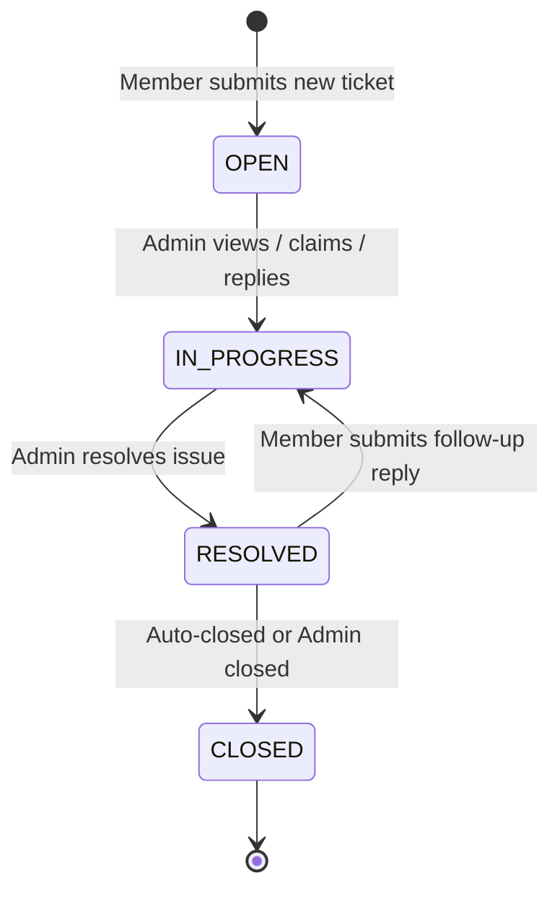

# Data Model & Schema Design: Sprint 2

**Feature**: `014-notifications-messaging-seo` (Sprint 2 — Notifications, Messaging, SEO & Final Integration)  
**Date**: 2026-09-28  
**Spec**: [spec.md](./spec.md)

---

## 1. Existing vs New Database Objects

Sprint 2 strictly respects migration discipline: existing historical migrations are never edited, and any required database object or constraint is packaged into a new forward migration paired with rollback and postflight scripts.

### Summary of Database Work

| Object Name | Object Type | Status | Migration Action |
|---|---|---|---|
| `public.notifications` | Table | Existing | Add index `idx_notifications_unread` on `(user_id) WHERE read_at IS NULL` (`20260929100000`). |
| `public.mark_notification_read(uuid)` | Function (RPC) | **NEW** | SECURITY DEFINER function updating `read_at = clock_timestamp()` for own notifications (`20260929100000`). |
| `public.mark_all_notifications_read()` | Function (RPC) | **NEW** | SECURITY DEFINER function updating all unread notifications for `auth.uid()` (`20260929100000`). |
| `public.get_unread_notification_count()` | Function (RPC) | **NEW** | Read-only helper returning unread count for `auth.uid()` (`20260929100000`). |
| `public.trg_notify_order_status_change` | Trigger | **NEW** | Fired after update on `orders` for `PROFORMA_ISSUED`, `HOLD`, and `EXPIRED` transitions (`20260929100000`). |
| `public.next_support_ticket_code()` | Function | Existing | Hardened `search_path = pg_catalog, public` returning `HLP-YYYYMMDD-XXXXXXX` (`20260929110000`). |
| `public.validate_support_ticket()` | Function (Trigger) | Updated | Hardened trigger enforcing server generation on INSERT and immutability on UPDATE (`20260929110000`). |
| `public.support_tickets` | Table | Existing | Reused with active RLS; `ticket_code` enforced immutable by trigger. |
| `public.support_messages` | Table | Existing | Reused as-is. Active RLS intact. |

---

## 2. Notification Data Model

### Table: `public.notifications` (Existing)

```text
Column Name         Type        Nullable    Default             Description
--------------------------------------------------------------------------------------------------
id                  uuid        NO          gen_random_uuid()   Unique notification ID (PK)
user_id             uuid        NO          -                   Recipient user (FK to auth.users)
organization_id     uuid        YES         -                   Context organization (FK to organizations)
notification_type   text        NO          -                   Category identifier
title               text        NO          -                   Localized headline string
body                text        NO          -                   Localized descriptive content
entity_type         text        YES         -                   Referenced table ('orders', etc.)
entity_id           uuid        YES         -                   Referenced record PK
read_at             timestamptz YES         null                Null = unread; Timestamp = read
created_at          timestamptz NO          now()               Monotonic creation timestamp
```

### New Database Functions (RPCs)

#### A. `public.mark_notification_read(p_notification_id uuid) RETURNS boolean`
* **Security**: `SECURITY DEFINER`, `SET search_path = pg_catalog, public`.
* **Behavior**:
  ```sql
  update public.notifications
  set read_at = coalesce(read_at, clock_timestamp())
  where id = p_notification_id
    and user_id = auth.uid()
    and read_at is null;
  return found;
  ```
* **Privileges**:
  ```sql
  revoke all on function public.mark_notification_read(uuid) from public, anon, service_role;
  grant execute on function public.mark_notification_read(uuid) to authenticated;
  ```

#### B. `public.mark_all_notifications_read() RETURNS integer`
* **Security**: `SECURITY DEFINER`, `SET search_path = pg_catalog, public`.
* **Behavior**:
  ```sql
  with updated as (
    update public.notifications
    set read_at = clock_timestamp()
    where user_id = auth.uid()
      and read_at is null
    returning 1
  )
  select count(*)::integer from updated;
  ```
* **Privileges**:
  ```sql
  revoke all on function public.mark_all_notifications_read() from public, anon, service_role;
  grant execute on function public.mark_all_notifications_read() to authenticated;
  ```

#### C. `public.get_unread_notification_count() RETURNS integer`
* **Security**: `SECURITY DEFINER`, `SET search_path = pg_catalog, public`.
* **Behavior**:
  ```sql
  select count(*)::integer
  from public.notifications
  where user_id = auth.uid()
    and read_at is null;
  ```
* **Privileges**:
  ```sql
  revoke all on function public.get_unread_notification_count() from public, anon, service_role;
  grant execute on function public.get_unread_notification_count() to authenticated;
  ```

### Order Notification Event Trigger

* **Trigger**: `trg_order_notification_events` on `public.orders`.
* **Condition**: Fired `AFTER UPDATE OF status, current_proforma_id ON public.orders FOR EACH ROW`.
* **Transitions**:
  1. `NEW.status = 'PROFORMA_ISSUED' AND OLD.status IS DISTINCT FROM 'PROFORMA_ISSUED'`:
     * Inserts into `public.notifications` for `user_id = NEW.created_by`, `organization_id = NEW.buyer_organization_id`:
     * `notification_type`: `'ORDER_PROFORMA_ISSUED'`
     * `title`: `'Proforma Invoice Issued'`
     * `body`: `'A proforma invoice has been generated for order ' || NEW.order_code`
     * `entity_type`: `'orders'`, `entity_id`: `NEW.id`
  2. `NEW.status = 'HOLD' AND OLD.status IS DISTINCT FROM 'HOLD'`:
     * `notification_type`: `'RESERVATION_CONFIRMED'`
     * `title`: `'Stock Reservation Confirmed'`
     * `body`: `'Inventory reserved for 20 minutes for order ' || NEW.order_code`
  3. `NEW.status = 'EXPIRED' AND OLD.status IS DISTINCT FROM 'EXPIRED'`:
     * `notification_type`: `'RESERVATION_EXPIRED'`
     * `title`: `'Stock Reservation Expired'`
     * `body`: `'The reservation window for order ' || NEW.order_code || ' has expired'`

---

## 3. Messaging Data Model

The messaging subsystem reuses the pre-existing, verified `support_tickets` and `support_messages` tables, adding hardened trigger immutability for `ticket_code` via forward migration `20260929110000_feature_014_support_ticket_reference.sql`.

### Table: `public.support_tickets` (Existing)

```text
Column Name                 Type        Nullable    Default                             Description
-----------------------------------------------------------------------------------------------------------------------------
id                          uuid        NO          gen_random_uuid()                   Ticket unique PK
ticket_code                 text        NO          public.next_support_ticket_code()   Immutable reference (e.g. HLP-20260928-0000001)
requester_user_id           uuid        NO          -                                   User who opened ticket (FK auth.users)
requester_organization_id   uuid        YES         -                                   Organization context (FK organizations)
order_id                    uuid        YES         -                                   Linked order (FK orders, optional)
order_code_snapshot         text        YES         -                                   Frozen code of linked order
subject                     text        NO          -                                   Thread title / topic
status                      text        NO          'OPEN'                              'OPEN' | 'IN_PROGRESS' | 'RESOLVED' | 'CLOSED'
priority                    text        NO          'NORMAL'                            'LOW' | 'NORMAL' | 'HIGH' | 'URGENT'
created_at                  timestamptz NO          now()                               Creation time (immutable)
updated_at                  timestamptz NO          now()                               Last update time
```

### Ticket Reference Generator & Validation Trigger

```sql
-- Sequence & Generator (Existing in database baseline)
create sequence if not exists public.support_ticket_code_seq;

create or replace function public.next_support_ticket_code()
returns text
language sql
set search_path = pg_catalog, public
as $$
  select 'HLP-' || to_char(clock_timestamp(), 'YYYYMMDD') || '-' || lpad(nextval('public.support_ticket_code_seq')::text, 7, '0');
$$;

-- Trigger Function: Server generation on INSERT, strict immutability on UPDATE
create or replace function public.validate_support_ticket()
returns trigger
language plpgsql
security definer
set search_path = pg_catalog, public, auth
as $$
begin
  if tg_op = 'INSERT' then
    -- Force server-generated ticket code; ignore any client-supplied input
    new.ticket_code := public.next_support_ticket_code();
  elsif tg_op = 'UPDATE' then
    -- Strict immutability guards
    if new.ticket_code is distinct from old.ticket_code then
      raise exception 'ticket_code_immutable';
    end if;
    if new.requester_user_id is distinct from old.requester_user_id then
      raise exception 'ticket_requester_user_immutable';
    end if;
    if new.requester_organization_id is distinct from old.requester_organization_id then
      raise exception 'ticket_requester_org_immutable';
    end if;
  end if;

  if new.order_id is not null then
    if not public.can_view_order(new.order_id) and not public.is_platform_admin() then
      raise exception 'order_not_accessible';
    end if;
    select coalesce(new.requester_organization_id, o.buyer_organization_id), o.order_code
    into new.requester_organization_id, new.order_code_snapshot
    from public.orders o
    where o.id = new.order_id;
  end if;
  return new;
end;
$$;
```

### Table: `public.support_messages` (Existing)

```text
Column Name         Type        Nullable    Description
-------------------------------------------------------------------------------------------
id                  uuid        NO          Message PK
ticket_id           uuid        NO          Parent ticket FK (support_tickets.id)
author_user_id      uuid        NO          Sender user ID (FK auth.users)
body                text        NO          Message content (1-4000 characters)
attachment_file_id  uuid        YES         Optional attachment reference (FK file_assets)
created_at          timestamptz NO          Creation timestamp
```

### Existing Active RLS Policies (Authoritative)

```sql
-- support_tickets
tickets_view_own_or_admin:
  SELECT TO public USING (
    is_platform_admin() OR
    requester_user_id = auth.uid() OR
    (requester_organization_id IS NOT NULL AND is_org_member(requester_organization_id))
  );

tickets_insert_own:
  INSERT TO public WITH CHECK (
    requester_user_id = auth.uid() AND NOT is_blocked_user()
  );

tickets_admin_update:
  UPDATE TO public USING (is_platform_admin()) WITH CHECK (is_platform_admin());

-- support_messages
messages_ticket_access:
  SELECT TO public USING (
    EXISTS (
      SELECT 1 FROM support_tickets st
      WHERE st.id = support_messages.ticket_id
        AND (is_platform_admin() OR st.requester_user_id = auth.uid() OR (st.requester_organization_id IS NOT NULL AND is_org_member(st.requester_organization_id)))
    )
  );

messages_insert_access:
  INSERT TO public WITH CHECK (
    author_user_id = auth.uid() AND
    EXISTS (
      SELECT 1 FROM support_tickets st
      WHERE st.id = support_messages.ticket_id
        AND (is_platform_admin() OR st.requester_user_id = auth.uid() OR (st.requester_organization_id IS NOT NULL AND is_org_member(st.requester_organization_id)))
    )
  );
```

---

## 4. State Machine & Lifecycle Transitions



### Transition Guard Rules
1. **Posting to Closed Tickets**: When `ticket.status = 'CLOSED'`, `support_messages` insertion is rejected by application validation unless explicitly reopened by platform admin.
2. **Reopening on Reply**: If a member posts a message to a `RESOLVED` ticket, the application server action automatically sets `status = 'IN_PROGRESS'` to alert operations.
