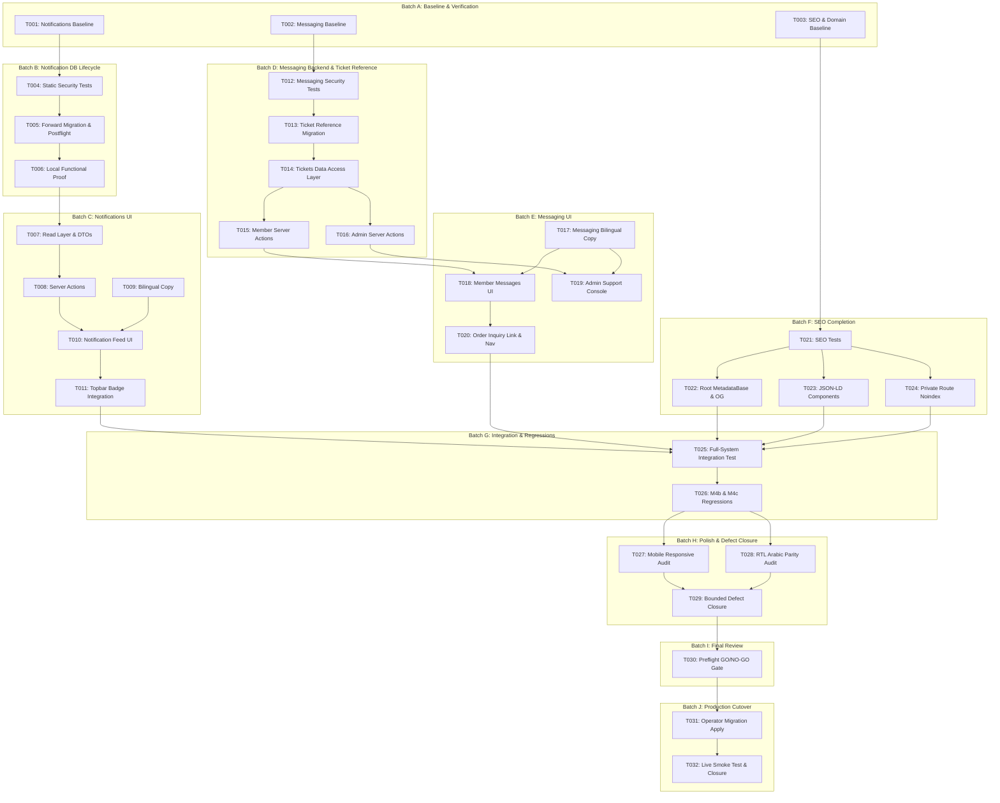

# Tasks Ledger: Sprint 2 — Notifications, Messaging, SEO & Final Integration

**Feature**: `014-notifications-messaging-seo`  
**Branch**: `014-notifications-messaging-seo`  
**Date**: 2026-09-28 (Amended with Support Ticket Reference Requirements)  
**Authoritative Sources**:
* Spec: [`specs/014-notifications-messaging-seo/spec.md`](./spec.md)
* Plan: [`specs/014-notifications-messaging-seo/plan.md`](./plan.md)
* Research: [`specs/014-notifications-messaging-seo/research.md`](./research.md)
* Data Model: [`specs/014-notifications-messaging-seo/data-model.md`](./data-model.md)
* Contracts: [`specs/014-notifications-messaging-seo/contracts/`](./contracts/)

---

## Task Summary & Statistics

* **Total Active Tasks**: 32
* **Task Batches**: 10 (Batches A through J)
* **User Stories Covered**:
  * Setup & Baseline: 3 tasks (T001–T003)
  * Foundational DB Lifecycle: 3 tasks (T004–T006)
  * User Story 1 (In-App Notifications): 5 tasks (T007–T011)
  * User Story 2 (Operational Messaging & Ticket Reference): 9 tasks (T012–T020)
  * User Story 3 (SEO & Brand Discoverability): 4 tasks (T021–T024)
  * User Story 4 (Full-System Integration): 2 tasks (T025–T026)
  * User Story 5 / Polish (Accessibility & RTL): 3 tasks (T027–T029)
  * Final Review & Preflight: 1 task (T030)
  * Production Cutover Gate: 2 tasks (T031–T032)
* **High-Risk Review Tasks (CODEX REVIEW RECOMMENDED)**: 6 tasks (T005, T013, T015, T025, T030, T031)
* **Migrations Planned**: 2 forward migrations:
  1. `supabase/migrations/20260929100000_feature_014_notifications_lifecycle.sql` (Notifications)
  2. `supabase/migrations/20260929110000_feature_014_support_ticket_reference.sql` (Support Ticket Reference & Immutability)

---

## Batch A — Baseline & Existing-State Verification

**Purpose**: Execute read-only verification of existing database objects, access control, routing, and environment configuration before introducing any code modifications.

- [X] T001 Baseline verification of notifications schema, RLS, read layer, and limitation state
  - **Exact Goal**: Verify the exact existing state of `public.notifications`, its active RLS policies (`notifications_own`), the read implementation in `lib/notifications/read.ts`, and the limitation statement in `lib/notifications/limitations.ts`.
  - **Likely Files**: `lib/notifications/read.ts`, `lib/notifications/limitations.ts`, `src/app/dashboard/notifications/page.tsx`, `supabase/trading_schema.sql`
  - **Dependency**: None (first task).
  - **Acceptance Criteria**:
    - Confirmed that `notifications` table has columns `id`, `user_id`, `organization_id`, `notification_type`, `title`, `body`, `entity_type`, `entity_id`, `read_at`, `created_at`.
    - Confirmed that current RLS policy allows `SELECT` only for `user_id = auth.uid() OR is_platform_admin()`, and that no `UPDATE` or `INSERT` policy currently exists for authenticated users.
    - Recorded baseline findings in development log without modifying any files.
  - **Validation / Test Expectation**: `npx vitest run tests/disputes/honest-limitations.test.ts` passes.

- [X] T002 Baseline verification of support_tickets and support_messages schema, RLS, triggers, and foreign keys
  - **Exact Goal**: Verify the exact existing state of `public.support_tickets` and `public.support_messages`, sequence `public.support_ticket_code_seq`, generator `public.next_support_ticket_code()`, triggers (`trg_support_updated_at`, `trg_support_ticket_validate`), and active RLS policies.
  - **Likely Files**: `supabase/trading_schema.sql`, `tests/public/dto-structure.test.ts`
  - **Dependency**: None (parallel with T001).
  - **Acceptance Criteria**:
    - Confirmed existing policies: `tickets_view_own_or_admin`, `tickets_insert_own`, `tickets_admin_update`, `messages_ticket_access`, and `messages_insert_access`.
    - Confirmed that `ticket_code` column exists with default `public.next_support_ticket_code()`, generating format `HLP-YYYYMMDD-XXXXXXX`.
    - Confirmed that foreign key `order_id` references `orders(id)` optionally (`ON DELETE SET NULL`), and `order_code_snapshot` exists.
    - Verified that no peer-to-peer or buyer-to-seller messaging tables exist or are referenced.
  - **Validation / Test Expectation**: Schema inspection query returns exact expected columns and policies matching `data-model.md §3`.

- [X] T003 Baseline verification of SEO metadata, robots, sitemap, indexing boundaries, and authoritative Production canonical domain resolution
  - **Exact Goal**: Inspect current SEO foundation in `src/app/layout.tsx`, `src/app/robots.ts`, `src/app/sitemap.ts`, and `lib/public/site.ts`; resolve authoritative Production domain from application configuration without exposing secrets.
  - **Likely Files**: `src/app/layout.tsx`, `src/app/robots.ts`, `src/app/sitemap.ts`, `lib/public/site.ts`, `tests/public/seo-boundary.test.ts`
  - **Dependency**: None (parallel with T001).
  - **Acceptance Criteria**:
    - Authoritative Production domain is resolved from `process.env.NEXT_PUBLIC_SITE_URL` / Vercel environment without printing environment secrets or tokens to console.
    - Confirmed that `src/app/layout.tsx` currently has placeholder metadata ("Create Next App") that must be updated.
    - Confirmed that `src/app/robots.ts` disallows `/dashboard`, `/dashboard-admin`, `/foundation-status`, and `/internal-test/`.
    - Confirmed that existing boundary tests pass: `npx vitest run tests/public/seo-boundary.test.ts`.
  - **Validation / Test Expectation**: `npx vitest run tests/public/seo-boundary.test.ts` exits with code 0.

---

## Batch B — Notification Database Lifecycle

**Purpose**: Author the forward migration adding narrow SECURITY DEFINER RPCs for notification read tracking, unread index, order milestone event trigger, accompanied by rollback, postflight, and static security tests.

**CRITICAL**: CODEX REVIEW RECOMMENDED. Do NOT perform Production apply during normal implementation.

- [X] T004 [P] Author static security tests for notification migration in tests/commerce/migrations/f014-notifications.test.ts
  - **Exact Goal**: Create static test suite verifying that the migration adheres to all security and architecture invariants before applying or executing SQL.
  - **Likely Files**: `tests/commerce/migrations/f014-notifications.test.ts`
  - **Dependency**: T001.
  - **Acceptance Criteria**:
    - Asserts that all 3 RPCs (`mark_notification_read`, `mark_all_notifications_read`, `get_unread_notification_count`) declare `SECURITY DEFINER` and `SET search_path = pg_catalog, public`.
    - Asserts that RPC privileges explicitly execute `REVOKE ALL ... FROM public, anon, service_role` and `GRANT EXECUTE ... TO authenticated`.
    - Asserts that `auth.uid()` is internally derived and no caller argument allows supplying an arbitrary `user_id`.
    - Asserts that mutation is strictly constrained to `read_at = clock_timestamp()` (or `coalesce`) on own rows (`user_id = auth.uid()`).
    - Asserts that partial index `idx_notifications_unread` exists on `(user_id) WHERE read_at IS NULL`.
    - Asserts that order status change trigger emits events ONLY for active commercial flows (`PROFORMA_ISSUED`, `HOLD`, `EXPIRED`), with no cancelled workflows.
  - **Validation / Test Expectation**: `npx vitest run tests/commerce/migrations/f014-notifications.test.ts` will fail until T005 artifacts are written, then pass 100%.

- [X] T005 Author forward migration, rollback, and postflight scripts for notification lifecycle in supabase/
  - **Exact Goal**: Write `20260929100000_feature_014_notifications_lifecycle.sql`, rollback script, and postflight verification script.
  - **Likely Files**:
    - `supabase/migrations/20260929100000_feature_014_notifications_lifecycle.sql`
    - `supabase/rollback/20260929100000_feature_014_notifications_lifecycle.rollback.sql`
    - `supabase/maintenance/20260929_feature_014_notifications_lifecycle_postflight.sql`
  - **Dependency**: T004.
  - **Security Acceptance Criteria**:
    - `mark_notification_read(p_notification_id uuid)` returns `boolean`, derives `auth.uid()`, updates `read_at` only where `user_id = auth.uid() AND read_at IS NULL`.
    - `mark_all_notifications_read()` returns `integer` (count updated) where `user_id = auth.uid() AND read_at IS NULL`.
    - `get_unread_notification_count()` returns `integer` counting unread rows for `user_id = auth.uid()`.
    - Hardened `SET search_path = pg_catalog, public` on all functions.
    - Narrow grants: `REVOKE ALL` from public/anon/service_role; `GRANT EXECUTE` to `authenticated`.
    - Partial index `create index if not exists idx_notifications_unread on public.notifications(user_id) where read_at is null;`.
    - Trigger `trg_notify_order_status_change` fires `AFTER UPDATE OF status ON public.orders` strictly for `PROFORMA_ISSUED`, `HOLD`, and `EXPIRED`.
    - Postflight script performs 5/5 exact deterministic checks asserting existence of RPCs, grants, index, and trigger.
  - **Validation / Test Expectation**: `npx vitest run tests/commerce/migrations/f014-notifications.test.ts` passes 100%.
  - **CODEX REVIEW RECOMMENDED**.

- [X] T006 Execute functional LOCAL proof for notification RPCs and triggers in scripts/test-notifications-local.ts
  - **Exact Goal**: Run a functional verification script against a local/ephemeral Supabase instance proving read marking, bulk read marking, unread count accuracy, and order trigger emission without touching Production.
  - **Likely Files**: `scripts/test-notifications-local.ts` (or integration test)
  - **Dependency**: T005.
  - **Acceptance Criteria**:
    - Proves `mark_notification_read` returns `true` on own unread row and sets `read_at`.
    - Proves `mark_notification_read` returns `false` when called on another user's notification (no mutation, zero leakage).
    - Proves `get_unread_notification_count` returns accurate count matching unread rows.
    - Proves `mark_all_notifications_read` updates all unread rows for calling user and resets unread count to 0.
    - Proves order transition to `PROFORMA_ISSUED`, `HOLD`, or `EXPIRED` automatically generates an in-app notification row for order buyer.
  - **Validation / Test Expectation**: Script executes cleanly with all functional assertions passing.

---

## Batch C — Notification Application & UI

**Purpose**: Wire the verified database read lifecycle into the application layer, provide Server Actions, display dynamic unread badge in navigation, render responsive notification feed with mark-as-read controls, and ensure full bilingual EN/AR parity.

- [X] T007 [P] [US1] Extend notification read layer and DTOs in lib/notifications/read.ts and lib/notifications/types.ts
  - **Exact Goal**: Update notification read functions to include `read_at`, expose `getUnreadNotificationCount()`, update DTOs, and update limitation flags in `lib/notifications/limitations.ts`.
  - **Likely Files**:
    - `lib/notifications/read.ts`
    - `lib/notifications/types.ts`
    - `lib/notifications/limitations.ts`
    - `tests/notifications/notifications-read.test.ts`
  - **Dependency**: T005, T006.
  - **Acceptance Criteria**:
    - `OwnNotificationDTO` includes `readAt: string | null`.
    - `getUnreadNotificationCount()` calls `supabase.rpc("get_unread_notification_count")` using session client.
    - `listOwnNotifications()` selects `read_at` and orders by `created_at DESC`.
    - `NOTIFICATION_LIMITATIONS.canMarkRead` updated to `true` (reflecting verified database capability).
    - Unit test `tests/notifications/notifications-read.test.ts` validates DTO mapping and error handling.
  - **Validation / Test Expectation**: `npx vitest run tests/notifications/notifications-read.test.ts` passes.

- [X] T008 [US1] Implement notification Server Actions in src/app/dashboard/notifications/actions.ts
  - **Exact Goal**: Create safe Server Actions `markNotificationReadAction` and `markAllNotificationsReadAction` calling database RPCs and revalidating cache paths.
  - **Likely Files**: `src/app/dashboard/notifications/actions.ts`
  - **Dependency**: T007.
  - **Acceptance Criteria**:
    - Uses `getRequestIdentity()` to assert caller is `authenticated`.
    - `markNotificationReadAction({ notificationId })` invokes `supabase.rpc("mark_notification_read", { p_notification_id })`.
    - `markAllNotificationsReadAction()` invokes `supabase.rpc("mark_all_notifications_read")`.
    - Calls `revalidatePath("/dashboard/notifications")` and `revalidatePath("/dashboard")`.
    - Never catches and hides critical errors; returns typed `{ ok: true } | { ok: false; error: string }`.
  - **Validation / Test Expectation**: Action contract tests pass in `tests/notifications/notifications-lifecycle.test.ts`.

- [X] T009 [P] [US1] Wire bilingual EN/AR copy for notifications in lib/app/copy/en.ts and lib/app/copy/ar.ts
  - **Exact Goal**: Add localized copy strings for mark-read button, mark-all-read action, unread badge aria-label, filter tabs, and order notification titles.
  - **Likely Files**: `lib/app/copy/en.ts`, `lib/app/copy/ar.ts`
  - **Dependency**: T001.
  - **Acceptance Criteria**:
    - English and Arabic dictionaries updated with identical keys for all notification actions and states.
    - Zero missing translation keys or raw fallback strings.
  - **Validation / Test Expectation**: Bilingual completeness test passes without key discrepancies.

- [X] T010 [US1] Update notification list page, read/unread styling, and mark-as-read controls in src/app/dashboard/notifications/page.tsx
  - **Exact Goal**: Enhance the notification list to visually distinguish unread from read rows, provide single-click "Mark as read", a "Mark all as read" button in header, and branded empty/loading states.
  - **Likely Files**:
    - `src/app/dashboard/notifications/page.tsx`
    - `components/notifications/notification-item.tsx`
    - `components/notifications/notification-limitation-notice.tsx`
  - **Dependency**: T008, T009.
  - **Acceptance Criteria**:
    - Unread items render with subtle brand highlight and unread indicator dot.
    - Each unread notification has an accessible "Mark as read" button calling `markNotificationReadAction`.
    - Header includes "Mark all as read" button when unread count > 0.
    - Retains safe escaping with `UntrustedText` for titles and bodies (SEC-005).
    - Limitation notice updated to reflect that in-app notification tracking is active and database-backed.
    - Displays responsive empty state when 0 notifications exist.
  - **Validation / Test Expectation**: Interactive component tests in `tests/notifications/notifications-lifecycle.test.ts` pass.

- [X] T011 [US1] Integrate dynamic unread notification badge in dashboard topbar and navigation in components/dashboard/topbar.tsx and src/app/dashboard/layout.tsx
  - **Exact Goal**: Wire server-side unread count retrieval into `DashboardNotificationsButton` in `components/dashboard/topbar.tsx` and layout header.
  - **Likely Files**:
    - `components/dashboard/topbar.tsx`
    - `src/app/dashboard/layout.tsx`
  - **Dependency**: T007, T010.
  - **Acceptance Criteria**:
    - Retrieves unread notification count via `getUnreadNotificationCount()`.
    - If `count > 0`, renders visual badge pill with count (or `99+` if > 99) with proper `aria-label="N unread notifications"`.
    - If `count === 0`, renders plain bell icon without badge.
    - Respects LTR/RTL badge placement.
  - **Validation / Test Expectation**: Header renders badge with exact count under test mock; snapshot test passes.

---

## Batch D — Messaging Backend & Security

**Purpose**: Implement secure Server Actions, support ticket reference code generation (`HLP-YYYYMMDD-XXXXXXX`), and trigger immutability guards reusing `support_tickets` and `support_messages` tables.

**CRITICAL**: CODEX REVIEW RECOMMENDED for T013 and T015. No Supabase Realtime tasks.

- [X] T012 [P] [US2] Author automated messaging security, ticket reference, and multi-tenant isolation tests in tests/support/support-messaging.test.ts
  - **Exact Goal**: Create automated test harness asserting that Server Actions, database triggers, and RLS enforce ticket reference uniqueness, immutability, server-side generation, and anti-spoofing guards.
  - **Likely Files**: `tests/support/support-messaging.test.ts`
  - **Dependency**: T002.
  - **Acceptance Criteria**:
    - Asserts that every ticket receives an immutable `ticket_code` formatted `HLP-YYYYMMDD-XXXXXXX`.
    - Asserts that attempting to update `ticket_code` throws `ticket_code_immutable` error.
    - Asserts that attempting to update `requester_user_id` or `requester_organization_id` throws an immutability exception.
    - Asserts that client input attempting to provide an arbitrary `ticket_code` on creation is ignored or overridden.
    - Asserts that caller cannot supply `author_user_id` or `requester_user_id` (server derives strictly from session).
    - Asserts that a member of Org A receives 403 / empty result when querying tickets belonging to Org B.
    - Asserts that a member of Org A cannot insert messages into Org B's tickets.
    - Asserts that non-administrators cannot call admin status update actions.
    - Asserts that sending a message on a `CLOSED` ticket is rejected with `TICKET_CLOSED`.
    - Asserts that database errors are sanitized and never exposed to the client.
  - **Validation / Test Expectation**: `npx vitest run tests/support/support-messaging.test.ts` passes 100% after T013–T016.

- [X] T013 [US2] Author forward migration, rollback, and postflight scripts for support ticket reference immutability in supabase/
  - **Exact Goal**: Write forward migration `20260929110000_feature_014_support_ticket_reference.sql`, rollback, and postflight scripts to harden sequence generation and update trigger `validate_support_ticket()` to strictly forbid `ticket_code` mutation.
  - **Likely Files**:
    - `supabase/migrations/20260929110000_feature_014_support_ticket_reference.sql`
    - `supabase/rollback/20260929110000_feature_014_support_ticket_reference.rollback.sql`
    - `supabase/maintenance/20260929_feature_014_support_ticket_reference_postflight.sql`
  - **Dependency**: T012.
  - **Security Acceptance Criteria**:
    - Hardens `public.next_support_ticket_code()` with `SET search_path = pg_catalog, public` generating `'HLP-' || to_char(clock_timestamp(), 'YYYYMMDD') || '-' || lpad(nextval('public.support_ticket_code_seq')::text, 7, '0')`.
    - Replaces `public.validate_support_ticket()` trigger:
      - On `INSERT`: Forces `new.ticket_code := public.next_support_ticket_code();`.
      - On `UPDATE`: Throws `ticket_code_immutable` if `new.ticket_code is distinct from old.ticket_code`.
      - On `UPDATE`: Throws `ticket_requester_user_immutable` if `new.requester_user_id is distinct from old.requester_user_id`.
      - On `UPDATE`: Throws `ticket_requester_org_immutable` if `new.requester_organization_id is distinct from old.requester_organization_id`.
    - Asserts unique constraint on `support_tickets(ticket_code)` is active.
    - Postflight script runs deterministic validation queries proving immutability trigger and format compliance.
  - **Validation / Test Expectation**: `npx vitest run tests/support/support-messaging.test.ts` passes database tests; postflight script exits 0.
  - **CODEX REVIEW RECOMMENDED**.

- [X] T014 [US2] Implement support messaging data access and DTO mappers in lib/messaging/tickets.ts
  - **Exact Goal**: Create server-only data access functions for listing member tickets, reading ticket detail with conversation messages, and listing admin operational tickets, selecting and mapping `ticket_code` into DTOs.
  - **Likely Files**: `lib/messaging/tickets.ts`, `lib/messaging/types.ts`
  - **Dependency**: T002, T013.
  - **Acceptance Criteria**:
    - `listMemberTickets({ organizationId, status, page, pageSize })`: Scoped to caller's acting organization using caller session client (`createClient()`). Selects `ticket_code` and maps to `SupportTicketListItemDTO`.
    - `getSupportTicketDetail(ticketId)`: Retrieves ticket and ordered messages (`created_at ASC`), includes `ticketCode: row.ticket_code`. Returns `null` if not found or unauthorized.
    - `listAdminTickets({ status, priority, page, pageSize })`: Scoped to `isPlatformAdmin`. Includes `ticketCode`.
    - Normal app reads/writes use user session client, never `service_role` bypass.
  - **Validation / Test Expectation**: Data access unit tests pass in `tests/support/support-messaging.test.ts`.

- [X] T015 [US2] Implement member support ticket Server Actions in src/app/dashboard/messages/actions.ts
  - **Exact Goal**: Create `createSupportTicketAction` and `sendSupportMessageAction` with strict server identity derivation, validation schemas, and path revalidation, returning generated `ticketCode`.
  - **Likely Files**: `src/app/dashboard/messages/actions.ts`
  - **Dependency**: T014.
  - **Security Acceptance Criteria**:
    - `createSupportTicketAction(input)`:
      - Validates input with Zod (`subject`: 3–200 chars, `initialMessage`: 1–4000 chars, `priority`, optional `orderId`).
      - Client input cannot supply or override `ticket_code`.
      - Derives `requester_user_id = identity.userId` from `getRequestIdentity()`. Requires `isAuthorizedMember`.
      - Derives `requester_organization_id = identity.organization.id`.
      - If `orderId` provided, validates order belongs to caller's organization and snapshots `order_code_snapshot`.
      - Inserts ticket (trigger generates `ticket_code`) and initial message using caller Supabase client.
      - Returns typed `{ ok: true, ticketId: string, ticketCode: string }`.
    - `sendSupportMessageAction(input)`:
      - Validates input (`ticketId`, `body`: 1–4000 chars).
      - Derives `author_user_id = identity.userId`.
      - Verifies ticket is not `CLOSED`. If `RESOLVED`, sets status to `IN_PROGRESS`.
      - Appends `support_messages` row and updates `support_tickets.updated_at = now()`.
      - Revalidates `/dashboard/messages` and `/dashboard/messages/[ticketId]`.
  - **Validation / Test Expectation**: Action contract tests pass in `tests/support/support-messaging.test.ts`.
  - **CODEX REVIEW RECOMMENDED**.

- [X] T016 [US2] Implement platform admin support Server Actions in src/app/dashboard-admin/(system)/messages/actions.ts
  - **Exact Goal**: Create `adminUpdateTicketStatusAction` and `adminSendSupportReplyAction` restricted to platform administrators.
  - **Likely Files**: `src/app/dashboard-admin/(system)/messages/actions.ts`
  - **Dependency**: T014.
  - **Acceptance Criteria**:
    - Verifies caller has `identity.isPlatformAdmin === true`; rejects non-admins with `UNAUTHORIZED`.
    - `adminUpdateTicketStatusAction({ ticketId, status, priority })`: Updates ticket status and priority in `support_tickets`.
    - `adminSendSupportReplyAction({ ticketId, body })`: Appends message with staff author ID and updates ticket `updated_at`.
    - Revalidates `/dashboard-admin/messages` and `/dashboard-admin/messages/[ticketId]`.
  - **Validation / Test Expectation**: Admin action tests pass in `tests/support/support-messaging.test.ts`.

---

## Batch E — Messaging UI

**Purpose**: Build the user-facing support interfaces: Member support portal (`/dashboard/messages`), Admin support console (`/dashboard-admin/messages`), ticket creation modal, message thread with staff distinction, order link badges, displaying `ticket_code` as the primary human-readable reference, and bilingual EN/AR parity.

- [X] T017 [P] [US2] Add bilingual EN/AR copy for support messaging in lib/app/copy/en.ts and lib/app/copy/ar.ts
  - **Exact Goal**: Provide localized copy for ticket statuses (`Open`, `In Progress`, `Resolved`, `Closed`), priorities, ticket reference labels, form labels, compose placeholder, empty states, and error alerts.
  - **Likely Files**: `lib/app/copy/en.ts`, `lib/app/copy/ar.ts`
  - **Dependency**: T002.
  - **Acceptance Criteria**:
    - Full parity across English and Arabic keys under `c.supportMessaging`.
    - Includes labels for `ticketReference`: "Ticket Reference" / "رقم التذكرة".
    - Clear, professional B2B tone adhering to Hills Green Coffee standards.
  - **Validation / Test Expectation**: Copy keys typecheck cleanly under `AppCopy` interface.

- [X] T018 [US2] Implement Member Support UI in src/app/dashboard/messages/page.tsx, thread detail, and components/messaging/
  - **Exact Goal**: Build member conversation list, ticket detail view with threaded messages, reply compose box, and "New Inquiry" modal, displaying `ticket_code` (`HLP-YYYYMMDD-XXXXXXX`) prominently and concealing raw UUIDs.
  - **Likely Files**:
    - `src/app/dashboard/messages/page.tsx`
    - `src/app/dashboard/messages/[ticketId]/page.tsx`
    - `components/messaging/ticket-list.tsx`
    - `components/messaging/message-thread.tsx`
    - `components/messaging/compose-box.tsx`
    - `components/messaging/new-ticket-modal.tsx`
    - `components/messaging/ticket-status-pill.tsx`
  - **Dependency**: T015, T017.
  - **Acceptance Criteria**:
    - Ticket list displays `ticket_code` (e.g. `HLP-20260928-0000001`) as the primary identifier badge on each ticket item; never exposes raw UUIDs.
    - Thread detail displays `ticket_code` in page header and breadcrumbs.
    - After ticket creation, confirmation modal or toast displays the generated `ticket_code`.
    - Thread detail displays chronologically ordered messages, distinct visual styling for Hills Staff vs Member messages, timestamps, and order reference link.
    - Reply compose box allows posting follow-ups; disabled if ticket is `CLOSED`.
    - Accessible form validation and loading state on submit.
    - Branded empty state when organization has 0 tickets.
  - **Validation / Test Expectation**: Component renders correctly in Vitest component tests; no layout shift; `ticket_code` present in DOM.

- [X] T019 [US2] Implement Admin Support Console in src/app/dashboard-admin/(system)/messages/
  - **Exact Goal**: Build platform admin operational support queue and thread response interface, displaying `ticket_code` prominently.
  - **Likely Files**:
    - `src/app/dashboard-admin/(system)/messages/page.tsx`
    - `src/app/dashboard-admin/(system)/messages/[ticketId]/page.tsx`
    - `components/admin/messaging/admin-ticket-queue.tsx`
    - `components/admin/messaging/admin-thread-view.tsx`
  - **Dependency**: T016, T017.
  - **Acceptance Criteria**:
    - Operational queue displays `ticket_code` in the first column for every ticket, filterable by status (`OPEN`, `IN_PROGRESS`, `RESOLVED`, `CLOSED`) and priority.
    - Admin thread viewer includes status transition controls (`Resolve`, `Close`, `Reopen`) and staff reply composer.
    - Displays `ticket_code` in thread heading; displays requester organization name and contact alongside thread.
    - Route guarded strictly by `isPlatformAdmin`.
  - **Validation / Test Expectation**: Admin page renders under test mock; unauthorized users receive forbidden state.

- [X] T020 [US2] Wire support inquiry entry point from Member Order detail page and register messages in dashboard navigation
  - **Exact Goal**: Add "Need Help with this Order?" button on order detail page pre-linking the ticket to `order_id`, and register `messages` in `lib/dashboard/registry.tsx`.
  - **Likely Files**:
    - `src/app/dashboard/orders/[orderId]/page.tsx`
    - `lib/dashboard/registry.tsx`
    - `components/dashboard/sidebar.tsx`
  - **Dependency**: T018.
  - **Acceptance Criteria**:
    - Order detail page includes link: `/dashboard/messages?new=1&orderId=[orderId]`.
    - Clicking pre-fills ticket subject with order code reference and links `order_id`.
    - `lib/dashboard/registry.tsx` registers `messages` module under `account` (or `support`) nav group with message icon.
    - Link renders only for authorized members.
  - **Validation / Test Expectation**: Navigation snapshot test passes; order detail link renders valid href.

---

## Batch F — SEO Completion & Boundary Hardening

**Purpose**: Replace placeholder metadata with production-ready root metadata, OpenGraph/Twitter cards, valid `schema.org` JSON-LD (`Organization`, `WebSite`, `Product`), and defense-in-depth `noindex` protection on all private routes.

- [X] T021 [P] [US3] Author automated SEO metadata, structured data, and boundary tests in tests/public/seo-structured-data.test.ts and extend tests/public/seo-boundary.test.ts
  - **Exact Goal**: Create test suite asserting root metadata tags, valid schema.org JSON-LD structure, canonical trailing-slash consistency, no invented /en or /ar paths, and strict noindex on private routes.
  - **Likely Files**:
    - `tests/public/seo-structured-data.test.ts`
    - `tests/public/seo-boundary.test.ts`
  - **Dependency**: T003.
  - **Acceptance Criteria**:
    - Verifies `metadataBase` resolves to authoritative production URL.
    - Verifies JSON-LD on `/` parses as valid `schema.org/Organization` and `WebSite`.
    - Verifies JSON-LD on `/coffee/[slug]/` parses as valid `schema.org/Product` without unauthenticated executable pricing.
    - Asserts that NO `/en/` or `/ar/` URL paths are created or linked in sitemap or canonicals.
    - Asserts that all private routes (`/dashboard/**`, `/dashboard-admin/**`, `/(auth)/**`, `/continue`, `/portal-entry`) carry `robots: { index: false, follow: false }`.
  - **Validation / Test Expectation**: `npx vitest run tests/public/seo-boundary.test.ts tests/public/seo-structured-data.test.ts` passes 100%.

- [X] T022 [US3] Configure production root metadata in src/app/layout.tsx
  - **Exact Goal**: Update `src/app/layout.tsx` metadata replacing "Create Next App" placeholder with verified `metadataBase`, title template `%s | Hills Coffee`, global description, OpenGraph, and Twitter cards.
  - **Likely Files**: `src/app/layout.tsx`
  - **Dependency**: T003, T021.
  - **Acceptance Criteria**:
    - `metadataBase` uses `new URL(siteOrigin())` from `lib/public/site.ts`.
    - Title configured as `{ default: "Hills Coffee — Dubai B2B Green Coffee Sourcing & Custody", template: "%s | Hills Coffee" }`.
    - Description accurately describes Dubai green coffee physical custody and trading.
    - OpenGraph default image points to `/images/og-default.jpg` with 1200x630 dimensions.
    - Twitter card set to `summary_large_image`.
    - Root `robots` allows public indexing (`{ index: true, follow: true }`).
  - **Validation / Test Expectation**: HTML render test confirms presence of meta tags in `<head>`.

- [X] T023 [P] [US3] Implement structured data JSON-LD components src/components/seo/json-ld-organization.tsx and src/components/seo/json-ld-coffee.tsx
  - **Exact Goal**: Create and embed valid `schema.org` JSON-LD script components for the homepage (`Organization` + `WebSite`) and public coffee detail pages (`Product`).
  - **Likely Files**:
    - `src/components/seo/json-ld-organization.tsx`
    - `src/components/seo/json-ld-coffee.tsx`
    - `src/app/page.tsx`
    - `src/app/(public)/coffee/[slug]/page.tsx`
  - **Dependency**: T021.
  - **Acceptance Criteria**:
    - `json-ld-organization.tsx`: Outputs `@type: "Organization"`, name "Hills Coffee Trading", URL, logo, address in Dubai UAE, and contact point.
    - `json-ld-coffee.tsx`: Outputs `@type: "Product"`, coffee name, origin country, process, variety, and honest availability status. Strictly omits private settlement prices or unauthenticated quote claims.
    - Injected via `<script type="application/ld+json" dangerouslySetInnerHTML={{ __html: JSON.stringify(data) }} />`.
  - **Validation / Test Expectation**: JSON-LD parses with `JSON.parse()` without error and satisfies schema validators.

- [X] T024 [US3] Enforce route-level defense-in-depth noindex, nofollow metadata across all private, dashboard, admin, and authentication routes
  - **Exact Goal**: Audit and enforce explicit `robots: { index: false, follow: false, nocache: true }` exports across every private route layout.
  - **Likely Files**:
    - `src/app/dashboard/layout.tsx`
    - `src/app/dashboard-admin/layout.tsx`
    - `src/app/(auth)/layout.tsx`
    - `src/app/continue/page.tsx`
    - `src/app/portal-entry/page.tsx`
  - **Dependency**: T021.
  - **Acceptance Criteria**:
    - Every private route layout exports `robots: { index: false, follow: false }`.
    - Public/private boundary test in `tests/public/seo-boundary.test.ts` scans all routes and passes 100%.
    - `robots.txt` disallows match private path prefixes exactly.
  - **Validation / Test Expectation**: `npx vitest run tests/public/seo-boundary.test.ts` passes.

---

## Batch G — Integration & Regression

**Purpose**: Execute full-system end-to-end integration tests covering catalogue, auth, member flow, cart, quote, proforma, reservation, messaging, notifications, ticket references, and SEO, and verify that all core commercial invariants (M4b 9/9, M4c 7/7) remain green.

**CRITICAL**: CODEX REVIEW RECOMMENDED for T025.

- [X] T025 [US4] Author and execute full-system integration test suite in tests/integration/full-system.test.ts
  - **Exact Goal**: Create comprehensive automated integration test suite validating the complete active lifecycle across all Sprint 1 and Sprint 2 features including support ticket reference presentation and immutability.
  - **Likely Files**: `tests/integration/full-system.test.ts`
  - **Dependency**: T010, T011, T018, T019, T022, T023, T024.
  - **Acceptance Criteria**:
    - Step 1: Public catalogue browses active lots and renders valid SEO metadata and JSON-LD.
    - Step 2: Unauthenticated user accessing `/dashboard/` is redirected to sign-in.
    - Step 3: Authenticated member adds lots to cart and calculates multi-seller quote estimate.
    - Step 4: Proforma is issued, frozen, and triggers `ORDER_PROFORMA_ISSUED` in-app notification.
    - Step 5: Stock reservation is confirmed for 20 minutes, reserving inventory atomically and emitting `RESERVATION_CONFIRMED` notification.
    - Step 6: Member opens support ticket linked to the order; verifies generated `ticket_code` (`HLP-YYYYMMDD-XXXXXXX`) appears in response and in ticket list.
    - Step 7: Member views notification feed, sees proforma notification, and clicks "Mark as read". Header badge decrements accurately.
    - Step 8: Platform admin accesses admin console, views support ticket by `ticket_code`, updates status, and replies.
    - Step 9: Multi-tenant boundary verified: member of Org B cannot access Org A's ticket or notification.
    - Step 10: Zero cancelled scope workflows present.
  - **Validation / Test Expectation**: `npx vitest run tests/integration/full-system.test.ts` passes 100%.
  - **CODEX REVIEW RECOMMENDED**.

- [X] T026 [US4] Execute database regression suites verifying M4b proforma checks (9/9) and M4c stock reservation checks (7/7)
  - **Exact Goal**: Run the existing committed regression test suites against the database schema to ensure zero regression in financial calculations, proforma freezing, or inventory reservation invariants.
  - **Likely Files**:
    - `tests/commerce/postflight-m4b.live.test.ts`
    - `tests/commerce/postflight-m4c-reservation.live.test.ts`
    - `tests/commerce/migrations/m4b-issuance.test.ts`
    - `tests/commerce/migrations/m4c-reservation.test.ts`
  - **Dependency**: T005, T013, T025.
  - **Acceptance Criteria**:
    - M4b postflight checks: 9/9 PASS.
    - M4c stock reservation checks: 7/7 PASS.
    - Zero regressions in inventory reservation decrements or proforma line totals.
  - **Validation / Test Expectation**: All commerce regression tests exit with 0 failures.

---

## Batch H — Defect Closure & Accessibility Polish

**Purpose**: Execute bounded polish across responsive viewports, RTL Arabic parity, touch targets, and loading/empty states for newly introduced UI components.

- [X] T027 Audit and ensure mobile responsive behavior and touch target compliance (< 640px)
  - **Exact Goal**: Verify that notification feeds, message threads, ticket reference badges, compose inputs, and dialogs adapt cleanly to mobile screens (375px–640px) with touch targets ≥ 44px.
  - **Likely Files**:
    - `components/messaging/ticket-list.tsx`
    - `components/messaging/message-thread.tsx`
    - `components/notifications/notification-item.tsx`
    - `src/app/dashboard/notifications/page.tsx`
  - **Dependency**: T010, T018.
  - **Acceptance Criteria**:
    - All interactive buttons and inputs have minimum 44x44px touch targets on mobile.
    - Conversation thread wraps text properly without horizontal scrolling or viewport blowout.
    - Modal dialogs render as responsive sheets or centered drawers on narrow viewports.
  - **Validation / Test Expectation**: Responsive viewport tests pass without layout overflow.

- [X] T028 Audit and ensure RTL Arabic visual parity and directionality across messaging and notifications
  - **Exact Goal**: Verify message bubble alignment, input directionality, icon placements, ticket reference number presentation (`dir="ltr"` on code numbers), and typography in Arabic mode (`dir="rtl"`).
  - **Likely Files**:
    - `components/messaging/message-thread.tsx`
    - `components/messaging/compose-box.tsx`
    - `components/notifications/notification-item.tsx`
  - **Dependency**: T010, T018.
  - **Acceptance Criteria**:
    - In Arabic RTL mode, message bubbles align correctly: member messages align right, operator replies align left (mirrored naturally).
    - Ticket code badges (`HLP-YYYYMMDD-XXXXXXX`) retain `dir="ltr"` so numbers read correctly in Arabic context.
    - Unread notification dots and timestamps display with proper RTL padding and orientation.
    - Input text fields respect natural Arabic text direction.
  - **Validation / Test Expectation**: Visual test confirms correct RTL classes and layout alignment.

- [X] T029 Resolve bounded defects, copy wiring gaps, and small UI inconsistencies discovered during testing
  - **Exact Goal**: Fix any small defects, missing copy keys, or UI inconsistencies discovered during integration runs without expanding scope or touching closed Sprint 1 files.
  - **Likely Files**: Scoped strictly to defect locations in `src/components/`, `src/app/`, or `lib/app/copy/`
  - **Dependency**: T025, T027, T028.
  - **Acceptance Criteria**:
    - All discovered bugs, translation gaps, and accessibility warnings are resolved.
    - No changes to cart, checkout, proforma, reservation, or cancelled scope files.
  - **Validation / Test Expectation**: Clean test run across all modified files.

---

## Batch I — Final Independent Review & Preflight

**Purpose**: Execute the formal independent GO/NO-GO preflight verification across the entire repository before operator cutover.

**CRITICAL**: CODEX REVIEW RECOMMENDED.

- [X] T030 Execute full repository preflight verification matrix (typecheck, lint, build, test, git diff)
  - **Exact Goal**: Perform comprehensive preflight validation ensuring zero TypeScript errors, zero ESLint warnings, 100% passing tests, successful Next.js production build, and clean git diff.
  - **Likely Files**: Entire workspace
  - **Dependency**: T025, T026, T029.
  - **Acceptance Criteria**:
    - `npm run typecheck` (`tsc --noEmit`): 0 errors.
    - `npm run lint` (`eslint .`): 0 warnings, 0 errors.
    - `npx vitest run`: 100% test suites pass.
    - `npm run build` (`next build`): Production build succeeds with 0 errors.
    - `git diff --check`: No whitespace or formatting violations.
    - No secrets, tokens, or PII committed in code or migrations.
    - No cancelled scope (M5a, M5b, Feature 009, M9, Stripe) reintroduced.
  - **Validation / Test Expectation**: All preflight commands exit with code 0.
  - **CODEX REVIEW RECOMMENDED**.

---

## Batch J — Production Cutover Gate (Operator Controlled)

**Purpose**: Provide operator-controlled tasks for applying the forward notification and support ticket reference migrations to the linked Production Supabase project, executing postflight queries, and smoke testing the live Vercel deployment.

**CRITICAL**: CODEX REVIEW RECOMMENDED for T031. Never apply during normal implementation.

- [ ] T031 [READY FOR OWNER PUSH / FINAL LIVE VERIFY] Execute operator-gated Production dry-run, migration apply, and postflight verification for feature migrations in supabase/
  - **Exact Goal**: Operator executes dry-run against linked Production project (`mxejnutukgxyccnohglo`), verifies only the approved forward migrations will apply, executes apply, and runs postflight query verifications.
  - **Likely Files**:
    - `supabase/migrations/20260929100000_feature_014_notifications_lifecycle.sql`
    - `supabase/migrations/20260929110000_feature_014_support_ticket_reference.sql`
    - `supabase/maintenance/20260929_feature_014_notifications_lifecycle_postflight.sql`
    - `supabase/maintenance/20260929_feature_014_support_ticket_reference_postflight.sql`
  - **Dependency**: T030 (requires independent final review GO verdict).
  - **Cutover Protocol**:
    1. Verify target project: `npx supabase projects list` (confirms `mxejnutukgxyccnohglo` = `hillscoffees-trading`).
    2. Dry-run: `npx supabase db push --linked --dry-run` (confirms ONLY expected forward migrations are pending).
    3. Explicit operator apply: `npx supabase db push --linked`.
    4. Run postflight verification:
       - Notifications postflight: `supabase/maintenance/20260929_feature_014_notifications_lifecycle_postflight.sql` (requires 5/5 PASS).
       - Support ticket reference postflight: `supabase/maintenance/20260929_feature_014_support_ticket_reference_postflight.sql` (requires PASS).
    5. Run regression checks: M4b (9/9 PASS) and M4c (7/7 PASS).
  - **Validation / Test Expectation**: All postflight checks pass on Production; 9/9 M4b pass; 7/7 M4c pass.
  - **CODEX REVIEW RECOMMENDED**.

- [ ] T032 [READY FOR OWNER PUSH / FINAL LIVE VERIFY] Execute live production smoke test on Vercel deployment (https://hills-coffees-trading.vercel.app)
  - **Exact Goal**: Verify live production deployment across public SEO tags, sitemap, notification feed badge, support ticket thread with `ticket_code` display, and admin console.
  - **Likely Files**: Live URLs on `https://hills-coffees-trading.vercel.app`
  - **Dependency**: T031.
  - **Acceptance Criteria**:
    - Homepage (`/`) and coffee detail (`/coffee/[slug]/`) serve valid title tags, meta description, and valid schema.org JSON-LD.
    - `/robots.txt` and `/sitemap.xml` resolve cleanly with HTTPS canonicals.
    - `/dashboard/notifications` renders with unread badge calculation and mark-as-read functionality.
    - `/dashboard/messages` allows creating a support ticket, displays generated `ticket_code` (`HLP-YYYYMMDD-XXXXXXX`), and sends replies.
    - `/dashboard-admin/messages` displays operational ticket queue with `ticket_code`.
    - Record final Sprint 2 closure.
  - **Validation / Test Expectation**: All live endpoints return 200 OK with expected DOM structures; Sprint 2 declared COMPLETE.

---

## Dependencies & Execution Order

---

## Parallel Execution Opportunities

The following tasks are marked `[P]` and can be executed independently or concurrently:

* **T001, T002, T003**: Baseline audits can be executed in parallel during Batch A.
* **T004 & T012 & T021**: Static and contract test authoring across Notifications, Messaging, and SEO can be developed in parallel.
* **T009 & T017**: Localized EN/AR copy additions in `lib/app/copy/` can be written in parallel.
* **T022, T023, T024**: SEO metadata, JSON-LD, and noindex boundary enforcement touch distinct files and can proceed in parallel.
* **T027 & T028**: Mobile viewport audit and RTL directionality audit can proceed in parallel.

---

## Implementation Strategy & MVP Milestone

### Milestone 1: Minimum Viable Product (Notifications + Core Messaging)
1. Complete Batch A (Baseline Verification).
2. Complete Batch B (Notification Migration & Local Proof).
3. Complete Batch C (In-App Notification Feed & Badge).
4. Complete Batch D & E (Support Ticket Reference Migration, Member Support Messaging & Admin Console).
*Validate*: Member can view notifications, mark them read, initiate a support thread with Hills, receive an immutable `ticket_code` (`HLP-YYYYMMDD-XXXXXXX`), and receive an admin reply.

### Milestone 2: Discoverability & Boundary Hardening (SEO)
1. Complete Batch F (Root Metadata, OpenGraph, JSON-LD, and Route Noindex).
*Validate*: SEO tests confirm valid schema.org structured data on public routes and zero indexation of private routes.

### Milestone 3: Full-System Verification & Cutover
1. Complete Batch G (Full-System Integration Suite + M4b 9/9 + M4c 7/7).
2. Complete Batch H (Accessibility, Mobile Responsive, RTL Polish).
3. Complete Batch I (Preflight Matrix Review).
4. Complete Batch J (Operator-Gated Production Migrations Apply & Live Smoke Test).
*Validate*: Live Vercel deployment verified end-to-end; Sprint 2 declared complete.
