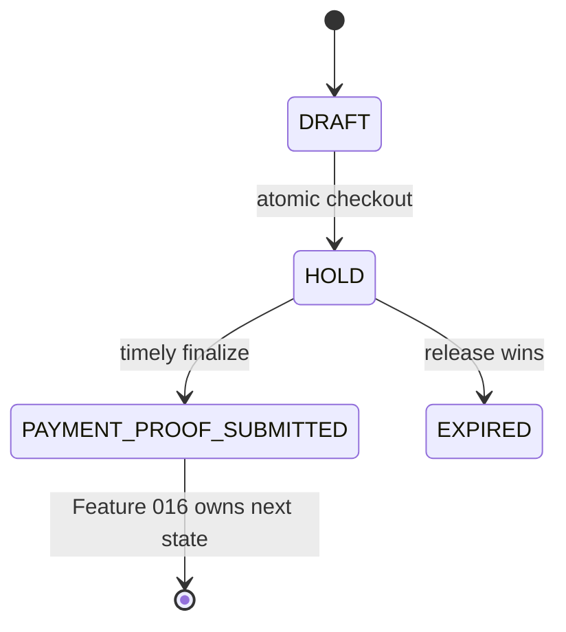

# Data Model: Feature 015

**Status:** Corrected pre-implementation design, grounded in the current Feature 013 schema and triggers.

## 1. Lifecycle

At checkout the transaction creates the reservation, complete proforma snapshot, bank-instruction snapshot and payment. The proforma follows the existing Feature 013 lifecycle: it is inserted `ISSUED` while the order is `DRAFT`, then updated in the same transaction to `CONFIRMED` with paired confirmation fields, before the order becomes `HOLD`.

## 2. Existing entities used by Feature 015

| Entity | Required Feature 015 rule |
|---|---|
| `orders` | `DRAFT → HOLD → PAYMENT_PROOF_SUBMITTED`; hold timestamps come from database time. |
| `inventory_reservations` | One open `ACTIVE` or `REVIEW_HOLD` row per order. `ACTIVE → REVIEW_HOLD` is allowed only by timely finalize. |
| `proforma_invoices` | Immutable Feature 013 snapshot. `ISSUED → CONFIRMED` is required to satisfy existing snapshot/lifecycle triggers. |
| `payments` | One row per order. At checkout, `amount` and `expected_amount` both equal the confirmed proforma `buyer_total`; status `PENDING`. Timely finalize sets `PROOF_SUBMITTED`. |
| `payment_proofs` | One authoritative on-time proof per payment; all customer-entered amount, date and reference fields remain non-authoritative. |
| `file_assets` | Private metadata linked to the proof. Its path is copied only from the finalized upload intent. |

## 3. New `payment_proof_upload_intents`

The migration will add a server-owned, single-use intent table. Suggested minimum shape:

| Column | Rule |
|---|---|
| `id` | UUID primary key, generated server-side. |
| `order_id` | Required order FK. |
| `buyer_organization_id` | Required, derived from the order. |
| `prepared_by` | Required, derived from `auth.uid()`. |
| `bucket_id`, `object_path` | Required exact canonical object identity; unique together. |
| `display_filename` | Optional sanitized display metadata only. |
| `expires_at` | Required; no later than the active reservation deadline. |
| `status` | `PREPARED`, `FINALIZED`, `EXPIRED`, `CLEANED`. |
| `finalized_proof_id` | Nullable FK, set only on finalization. |
| `prepare_request_id` | Required unique idempotency key. |
| `created_at`, `finalized_at`, `cleaned_at` | Database timestamps. |

Constraints: exactly one nonterminal (`PREPARED`) intent per order, unique exact object identity, status/timestamp consistency, and no direct browser writes. The path is `org/<org>/orders/<order>/<intent>/proof`; filename is not part of it.

## 4. Authorization model

The owning buyer must be an active, MFA-satisfied member with `organization_can_buy`. This same predicate governs upload, Storage reads, `payment_proofs` reads and proof-linked `file_assets` reads. Generic buyer membership alone is insufficient. Finance and platform admins can read finalized proof bytes and metadata, but cannot upload. Sellers, warehouse users, unrelated organizations and anonymous users have no proof access.

## 5. Reservation and expiry integrity

Existing `REVIEW_HOLD`, the open-reservation unique index, the `ACTIVE` expiry index and sweeper predicate are reused. The locked `clock_timestamp()` check in finalize is the only deadline decision. If release wins, the release function's returned boolean is recorded truthfully in the structured result and all terminal rows are re-read before return. If finalize wins, it changes the row to `REVIEW_HOLD` while locked, so the sweeper cannot release it.

## 6. Out of scope

This model contains no review decision, `PAID`, inventory sale finalization, delivery, settlement or payout state. Those belong to Feature 016.
