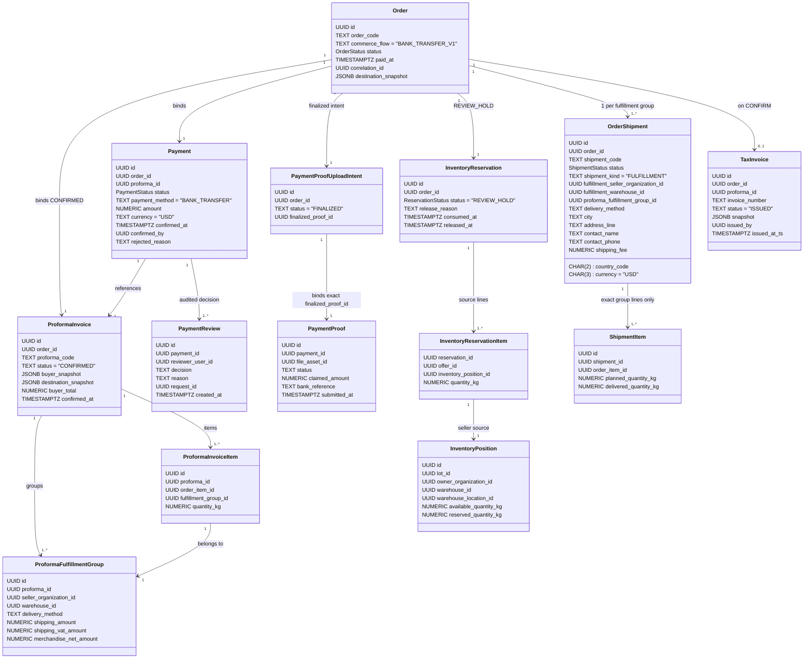

# Feature 016 — Data Model & Lifecycle Architecture (Final Planning Correction Pass)

**Feature**: Feature 016 — Finance Confirmation & Delivery Handoff  
**Date**: 2026-10-01  
**Status**: Revised (All Codex Findings Addressed)  

---

## 1. Domain Entities & State Machines



---

`inventory_reservation_items` has composite primary identity **`(reservation_id, offer_id)`**. Its actual columns are `reservation_id`, `offer_id`, `inventory_position_id`, and `quantity_kg`; it has no surrogate `id`. Reservation-line validation, ownership-event derivation, and terminal integrity counts use that composite identity.

## 2. Inventory Conservation & State Transition Rules

### 2.1 Confirmation Inventory Conservation (HIGH 1 / LOW)
Upon confirmation via `finance_review_bank_transfer_v1(p_order_id, p_payment_id, 'CONFIRMED', ...)`:
For each line `iri` in `public.inventory_reservation_items`:

1. **Signed Conservation Equations**:
   * For quantity $q = \text{iri.quantity\_kg}$:
     $$\Delta \text{seller\_available} = -q$$
     $$\Delta \text{seller\_reserved} = -q$$
     $$\Delta \text{buyer\_available} = +q$$
     $$\Delta \text{buyer\_reserved} = 0$$
   * Platform Total On-Hand Balance Invariant:
     $$\Delta \text{seller\_available} + \Delta \text{buyer\_available} = -q + q = 0$$
   * Magnitudes:
     $$\text{seller available decrease magnitude} = q$$
     $$\text{buyer available increase magnitude} = q$$

2. **Pre-Mutation Assertions**:
   * Sourced directly from `inventory_reservation_items`.
   * Assert `seller_pos.available_quantity_kg - iri.quantity_kg >= 0`.
   * Assert `seller_pos.reserved_quantity_kg - iri.quantity_kg >= 0`.

3. **Deterministic Concurrency & Locking Protocol (HIGH 4)**:
   * Derive all source position IDs from `iri.inventory_position_id`.
   * Derive all buyer logical keys `(lot_id, buyer_org_id, warehouse_id, warehouse_location_id)`.
   * Sort distinct buyer logical keys deterministically by `(lot_id, buyer_org_id, warehouse_id, coalesce(warehouse_location_id, '00000000-0000-0000-0000-000000000000'::uuid))`.
   * Acquire transaction-scoped advisory locks for absent/logical buyer keys in sorted order:
     `PERFORM pg_advisory_xact_lock(hashtext(v_buyer_key::text)::bigint)`.
   * Resolve existing buyer `inventory_position` IDs.
   * Lock ALL existing source and buyer position rows in one global ascending UUID order:
     `SELECT id FROM public.inventory_positions WHERE id IN (...) ORDER BY id ASC FOR UPDATE;`.
   * Mutate seller position:
     ```sql
     update public.inventory_positions
     set available_quantity_kg = available_quantity_kg - iri.quantity_kg,
         reserved_quantity_kg = reserved_quantity_kg - iri.quantity_kg,
         updated_at = clock_timestamp()
     where id = iri.inventory_position_id;
     ```
   * Mutate buyer position using null-safe upsert:
     ```sql
     insert into public.inventory_positions (
       lot_id, owner_organization_id, warehouse_id, warehouse_location_id,
       available_quantity_kg, reserved_quantity_kg
     ) values (
       v_lot_id, v_buyer_org_id, v_warehouse_id, v_warehouse_location_id,
       iri.quantity_kg, 0
     )
     on conflict (lot_id, owner_organization_id, warehouse_id, warehouse_location_id)
     do update set
       available_quantity_kg = public.inventory_positions.available_quantity_kg + excluded.available_quantity_kg,
       updated_at = clock_timestamp();
     ```

### 2.2 Rejection Release Write Ordering
Upon rejection via `finance_review_bank_transfer_v1(p_order_id, p_payment_id, 'REJECTED', ...)`:
For each line `iri` in `public.inventory_reservation_items`:

1. **Write Step 1 (Backing Position)**:
   * Enforce: `reserved_quantity_kg - iri.quantity_kg >= 0`.
   * Decrement:
     ```sql
     update public.inventory_positions
     set reserved_quantity_kg = reserved_quantity_kg - iri.quantity_kg,
         updated_at = clock_timestamp()
     where id = iri.inventory_position_id;
     ```
2. **Write Step 2 (Listing Offer)**:
   * Enforce: `reserved_quantity_kg - iri.quantity_kg >= 0`.
   * Decrement:
     ```sql
     update public.coffee_offers
     set reserved_quantity_kg = reserved_quantity_kg - iri.quantity_kg,
         updated_at = clock_timestamp()
     where id = iri.offer_id;
     ```
3. **Trigger Compliance**: Writing backing positions before listing offers ensures full compliance with `validate_offer_transition` and prevents balance drift.

---

## 3. Database Constraints & Preflight Rules

### 3.1 Null-Safe Buyer Position Constraint (HIGH 4)
```sql
alter table public.inventory_positions
  add constraint uq_inventory_positions_null_safe
  unique nulls not distinct (lot_id, owner_organization_id, warehouse_id, warehouse_location_id);
```

### 3.2 Migration Preflight: Abort on Existing Duplicates (Owner Decision)
Pre-existing duplicate positions MUST NOT be automatically merged, deleted, or repointed during migration.
```sql
do $preflight$
declare
  v_dup_count int;
  v_details text;
begin
  select count(*), coalesce(string_agg(
    format('(lot=%s, owner=%s, wh=%s, loc=%s, count=%s)', lot_id, owner_organization_id, warehouse_id, warehouse_location_id, c),
    '; '
  ), 'none')
  into v_dup_count, v_details
  from (
    select lot_id, owner_organization_id, warehouse_id, warehouse_location_id, count(*) as c
    from public.inventory_positions
    group by lot_id, owner_organization_id, warehouse_id, warehouse_location_id
    having count(*) > 1
  ) dups;

  if v_dup_count > 0 then
    raise exception 'migration_aborted: duplicate logical inventory positions detected. Manual reconciliation required: %', v_details;
  end if;
end $preflight$;
```

### 3.3 Feature 009 FULFILLMENT Shipment Mapping (HIGH 1)
For EACH fulfillment group in `public.proforma_fulfillment_groups`:
* **Exact Item Membership**: `shipment_items` includes ONLY lines belonging to that fulfillment group:
  ```sql
  where pii.proforma_id = v_proforma.id and pii.fulfillment_group_id = v_group.id
  ```
* **Destination Mapping**:
  * Snapshot column stores `address_lines` JSON array.
  * Mapped into `order_shipments.address_line` text:
    `array_to_string(ARRAY(SELECT jsonb_array_elements_text(v_proforma.destination_snapshot->'address_lines')), ', ')`.
  * `country_code := v_proforma.destination_snapshot->>'country_code'`.
  * `city := v_proforma.destination_snapshot->>'city'`.
  * `contact_name := v_proforma.destination_snapshot->>'contact_name'`.
  * `contact_phone := v_proforma.destination_snapshot->>'contact_phone'`.
* **Frozen Delivery Method**:
  * Preserved from `v_group.delivery_method` (never hardcoded to `'Courier'`).
* **Required Shipment Fields**:
  * `order_id`, `shipment_kind = 'FULFILLMENT'`, `fulfillment_seller_organization_id`, `fulfillment_warehouse_id`, `proforma_fulfillment_group_id`, `created_by`, destination fields, `delivery_method`, `shipping_fee`, `currency = 'USD'`.
* **Creation Sequence**:
  1. Set `app.internal_transition = true` transaction-locally before the first guarded write.
  2. Insert `order_shipments` in `status = 'DRAFT'` and then its `shipment_items` for that group only.
  3. Update `order_shipments` to `status = 'REQUESTED'` under that same transaction-local setting. The same setting must already cover the guarded tax-invoice insert and internal order/reservation writes.

---

## 4. Authoritative Proforma & Proof Binding (HIGH 2)

### Proforma Status
The authoritative proforma produced by Feature 015 checkout is `CONFIRMED`. Feature 016 requires one row where all real pointers agree: `v_payment.proforma_id = v_order.current_proforma_id = v_reservation.proforma_id = v_proforma.id`; it also requires `v_proforma.order_id = v_order.id` and `v_proforma.status = 'CONFIRMED'`. Any missing or divergent pointer fails closed. It MUST NOT choose a “latest by order” row and MUST NOT require `ISSUED`.

### Exact Proof Binding
The review RPC binds to the exact proof identified by `payment_proof_upload_intents.finalized_proof_id`:
* Finalized upload intent: `payment_proof_upload_intents` where `order_id = p_order_id and status = 'FINALIZED'`.
* Exact proof: `payment_proofs` where `id = v_intent.finalized_proof_id and payment_id = v_payment.id`.
* Initial mutation requires proof `SUBMITTED`; terminal replay validates its persisted `ACCEPTED` or `REJECTED` state.
* Proof Mutation: updates ONLY that exact row's `status`; `payment_proofs` has no `updated_at` column. Arbitrary or bulk proof updates are prohibited.

---

## 5. Notification Single-Owner Architecture (MEDIUM 1)

### Single Database Trigger Ownership
`PAYMENT_PROOF_SUBMITTED` notification is owned SOLELY by the database order-status transition trigger `trg_notify_order_status_change` upon committed transition into `orders.status = 'PAYMENT_PROOF_SUBMITTED'`.
* `finalize_payment_proof` MUST NOT insert notifications directly.

### Lifecycle Vocabulary & Deduplication Identities
| Notification Type | Recipient Audience | Triggering DB Event | Deduplication Identity |
| :--- | :--- | :--- | :--- |
| `PAYMENT_PROOF_SUBMITTED` | Finance & Platform Admin operators | `orders.status` → `PAYMENT_PROOF_SUBMITTED` | `order_id:PAYMENT_PROOF_SUBMITTED` |
| `PAYMENT_CONFIRMED` | Existing Feature 014 recipient: `orders.created_by` in `buyer_organization_id` | `orders.status` → `PAID` | `order_id:PAID` |
| `PAYMENT_REJECTED` | Existing Feature 014 recipient: `orders.created_by` in `buyer_organization_id` | `orders.status` → `PAYMENT_REJECTED` | `order_id:PAYMENT_REJECTED` |
| `DELIVERY_HANDOFF_REQUESTED` | Active `organization_members` of `warehouses.owner_organization_id` for `fulfillment_warehouse_id` | FULFILLMENT `order_shipments.status` `DRAFT` → `REQUESTED` | `shipment_id:REQUESTED`, per recipient |

There is no current shipment notifier. The forward migration adds `commerce_notify_shipment_status_change()` and `trg_notify_shipment_status_change`; it joins real `warehouses.owner_organization_id` and `organization_members.organization_id/user_id/is_active`, with `NOT EXISTS` dedupe per `(user_id, notification_type, entity_type, entity_id)`. Rollback removes both and postflight verifies trigger binding, recipient predicate, and dedupe. Server Actions have no notification writer role.

---

## 6. RLS & Privilege Matrix

| Surface / Action | Platform Admin | Finance Operator | Warehouse Operator | Buyer Member | Seller Member | Public / Anon |
| :--- | :---: | :---: | :---: | :---: | :---: | :---: |
| **Execute `finance_review_bank_transfer_v1`** | Allowed | Allowed | Denied (403) | Denied (403) | Denied (403) | Denied (401) |
| **Read `/dashboard-admin/payments`** | Allowed | Allowed | Denied (403) | Denied (403) | Denied (403) | Denied (401) |
| **Download Private Proof via Signed URL** | Allowed | Allowed | Denied | Own Orders | Denied | Denied |
| **Read `payment_reviews`** | Allowed | Allowed | Denied | Denied | Denied | Denied |
| **Read `order_shipments` (FULFILLMENT)** | Allowed | Allowed | Allowed (All) | Own Orders | Own Groups | Denied |
| **Read `tax_invoices`** | Allowed | Allowed | Denied | Own Orders | Denied | Denied |
